## 👋 Hi, I'm Marlena

💻 **Software Developer | Homelab Enthusiast | Productivity Passionate**

I’m passionate about **self-hosting, homelab and programming**.  

If you’d like to see more of my work, feel free to visit my personal website 🌐 [**marlenamakosza.com**](https://marlenamakosza.com).

### 🚀 What I Do  
- **Fullstack Development** – Making **applications** with **Svelte, SvelteKit, TypeScript, Nodejs**.  
- **Homelab & Self-Hosting** – **Proxmox, NAS and Docker**.  
- **Smart Note-Taking** – Refining my **Emacs & Trillium** setup for structured knowledge management.  
<!--- **System Automation & Productivity** – Designing **AI-assisted planning tools** and automating workflows. -->

### 🛠 Tech Stack  
✔ **Languages:** TypeScript, .NET  
✔ **Frameworks & Tools:** Nodejs, Svelte, SvelteKit, Eslint, Drizzle  
✔ **Infrastructure:** Vagrant, Docker, Proxmox, Linux (Alpine, Arch, Debian)  
✔ **Dev Tools:** Git, Emacs, VSCode, WebStorm, Zed  
✔ **AI Tools:** Claude Code  

### 🎯 What I’m Working On
🔹 **[LLM-God](https://github.com/czhou578/llm-god)** – Contributing in app "One to rule them all" for popular LLM models.
🔹 ON HOLD **Character relationships** – Visualizing relationships between characters (mainlny for gamemasters, writers and character builders)  
🔹 ON HOLD - **JS-TS-tools-config-example** – example of configs for TS/JS tools  
<!--
🔹 **Student Simulator** - game like Undertale graphic
🔹 **Project PLAG (programming languages as genus** - main thread is programming languages as character races
🔹 **Homelab Expansion** – Setting up some opensource services
🔹 **AI-Powered Time Management** – A tool for **task optimization and motivation tracking**
-->

### 📌 Exploring
🧪 Github Actions
🧪 Terraform and ansible to automate my homelab  
🧪 Upgrade my working setup  
🧪 Deno  
🧪 ON HOLD C++ and RayLib  
🧪 ON HOLD - AI-assisted **decision-making & planning, AI with code, prompt engineering**  
<!-- ✔ **Optimizing digital workflows & productivity systems**-->

### Github stats

<!---->

